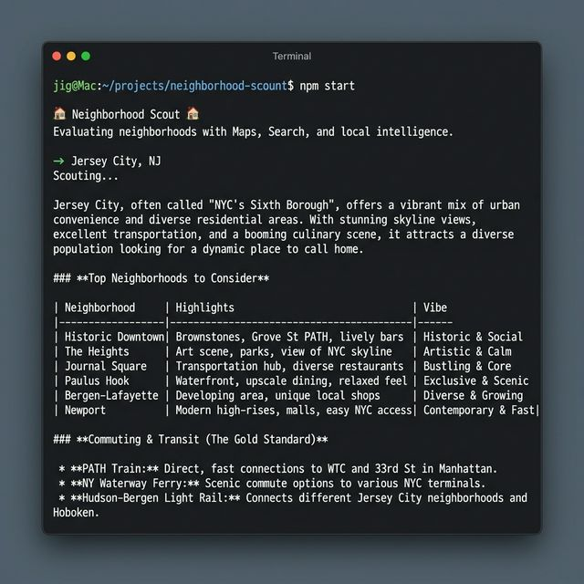

# 🏘️ Neighborhood Scout

Evaluating neighborhoods with state-of-the-art AI. Built using the **Gemini @google/genai SDK** and **[A2UI v0.9](https://a2ui.org/specification/v0.9-a2ui/)**.

Neighborhood Scout is a dual-interface agent designed to help users evaluate neighborhoods. It leverages the official **`@google/genai`** SDK to orchestrate multi-tool grounding and context circulation server-side via the [**Interactions API**](https://ai.google.dev/gemini-api/docs/interactions?ua=chat). Agent responses are enhanced with **A2UI** — a protocol that lets the agent emit structured UI alongside text, rendered natively by the React frontend.

## 🚀 Features

- **Dual Interfaces**: High-speed **CLI** for terminal power users and a **Premium Web UI** with a modern dark-mode aesthetic.
- **Rendered Reports**: Web version features full **Markdown rendering** for professional and readable scouting reports.
- **A2UI Surfaces**: Agent responses include structured UI components — score cards, comparison layouts, trend charts — rendered live in the chat alongside the text response.
- **Combined Tool Grounding**: Seamlessly integrates **Google Maps**, **Google Search**, and **Custom Functions**.
- **Context Circulation**: Automatic data transfer between tools (e.g., Search results flowing into budget calculations).
- **Interactive Surfaces**: A2UI button clicks (e.g., "Save to Favorites") flow back to the agent as structured actions, closing the human-in-the-loop.

## 🖥️ Web Interface


## 📟 CLI Interface


## 🛠️ Getting Started

### Prerequisites
- Node.js (v18+)
- A Google AI API Key (from [Google AI Studio](https://aistudio.google.com/)).

### Installation
1.  Clone the repository and install dependencies:
    ```bash
    git clone https://github.com/ppongtong/neighborhood-scout.git
    cd neighborhood-scout
    npm install
    ```
2.  Configure your environment in a `.env` file:
    ```env
    GOOGLE_API_KEY=your-api-key-here
    ```
3.  Build the project:
    ```bash
    npm run build
    ```

| Interface | Command | Description |
| :--- | :--- | :--- |
| **CLI** | `npm start` | Fast, terminal-based scouting. |
| **Web** | `npm run dev:web` | Starts Backend (3001) and Frontend (5173). |
| **Tests** | `npm test` | Runs unit tests using Vitest. |

---

## ⚡ Gemini Interactions API

### What is the Interactions API?

The **Interactions API** is Gemini's stateful, multi-turn agent API. It replaces the older `generateContent` call — instead of sending the full conversation history on every request, the API manages conversation state server-side. You reference a prior turn with `previous_interaction_id` and the model picks up exactly where it left off.

This matters for agents because tool use is inherently multi-turn:

```
Turn 1: User asks a question
Turn 2: Model responds with function_call (wants to run a tool)
Turn 3: Client executes the tool, sends result as function_result
Turn 4: Model incorporates the result and responds
```

With `generateContent` you'd have to track and replay the entire message history yourself. With the Interactions API, the model holds that state — each turn just needs the previous `interaction_id`.

### How it differs from `generateContent`

| | `generateContent` | Interactions API |
| :--- | :--- | :--- |
| State management | Client sends full history every time | Server stores state; client sends `previous_interaction_id` |
| Multi-turn tool use | Manual history reconstruction | Native — each turn builds on the last |
| Grounding (Search/Maps) | Available | Available |
| Response shape | `GenerateContentResponse` | `Interaction` object with `id`, `status`, `outputs` |
| When `status === "requires_action"` | N/A | Model wants tool results; client must respond |

### The `requires_action` loop

When the model needs to call a tool, it returns `status: "requires_action"` with one or more `function_call` outputs. The client executes the tool locally and submits the result back — the model then continues:

```
POST /api/start  →  { status: "requires_action", outputs: [{ type: "function_call", name: "calculate_budget_fit", ... }] }
                                    │
                          execute tool locally
                                    │
POST /api/tool-results  →  { status: "completed", outputs: [{ type: "text", text: "..." }] }
```

This loop can repeat multiple times if the model decides to call several tools in sequence. In this app the loop runs on the **client side** in `App.tsx` — the server exposes thin endpoints that each make a single Interactions API call, and the frontend drives the loop.

### How this app uses it

The `InteractionsAPI` wrapper in `src/lib/interactions-api.ts` exposes three methods:

```typescript
// First message in a session — creates a new interaction
api.startInteraction({ model, tools, systemInstruction, input })

// Follow-up message — links to prior turn via lastId
api.sendMessage({ model, tools, systemInstruction, input })

// Submit tool results after a requires_action turn
api.sendToolResults({ model, tools, systemInstruction, results })
```

The wrapper stores `lastId` after each call and passes it as `previous_interaction_id` automatically. The server creates one `InteractionsAPI` instance per server process, so all users in the same session share context — suitable for a single-user dev setup.

### Tools and grounding

Tools are passed on every call as a formatted array. The app configures three types:

```typescript
tools: {
  googleSearchGrounding: true,   // → { type: "google_search" }
  googleMapsGrounding: true,     // → { type: "google_maps" } (currently disabled — cannot combine with google_search in preview)
  functionDeclarations: [...]    // → { type: "function", name, description, parameters }
}
```

**Google Search grounding** is how the agent fetches real data — average rent, safety scores, walkability — before calling custom tools. The model searches, extracts values, and passes them as tool arguments. This is why `calculate_budget_fit` receives `average_rent` as a parameter rather than looking it up itself.

### API endpoints

| Endpoint | Method | Purpose |
| :--- | :--- | :--- |
| `/api/start` | POST | First message — calls `startInteraction` |
| `/api/message` | POST | Follow-up message — calls `sendMessage` |
| `/api/tool-results` | POST | Submit tool outputs — calls `sendToolResults` |
| `/api/execute-tool` | POST | Run a tool function locally and return the result |
| `/api/user-action` | POST | Convert an A2UI button click into a `sendMessage` call |

All five endpoints run the result through `withParsed()` (except `/api/execute-tool`) so the response always includes `parsed: { text, a2uiMessages }`.

---

## 🎨 A2UI — Agent-to-User Interface

### What is A2UI?

**A2UI** is an open protocol that lets an AI agent generate structured UI alongside its text responses. Instead of describing data in prose ("The budget fit score is 7.5 out of 10 — Affordable"), the agent emits a JSON description of a UI surface: a card with a progress bar, a label, and a chip showing the verdict. The client renders that JSON using its own React components — the agent controls *what* to show, the client controls *how* it looks.

Think of it as the agent speaking two languages at once: Markdown for narrative, and A2UI JSON for structured, interactive UI.

### Why use A2UI?

Before A2UI, every agent response in Neighborhood Scout was Markdown text. That works fine for descriptions, but it has real limitations:

| Without A2UI | With A2UI |
| :--- | :--- |
| Budget score shown as "7.5/10" in prose | Visual progress bar with color-coded verdict chip |
| Comparison matrix as a Markdown table | Side-by-side score bars, scannable at a glance |
| Rent trends described in a paragraph | Interactive dual-axis line chart (rent vs. safety/walkability) |
| "Save favorite?" answered in text | Button click flows back to the agent as a structured action |

The key insight: **tool results are structured data**. A2UI lets the agent compose UI directly from that structured data, rather than converting it to prose and losing the structure.

### The A2UI Mental Model

A2UI has three core concepts:

1. **Surface** — a named canvas (`surfaceId`) where components are rendered. Created with `createSurface`, destroyed with `deleteSurface`.

2. **Component tree** — a flat list of components (each with an `id` and `component` type), where containers reference children by ID. One component must have `id: "root"`. Sent via `updateComponents`.

3. **Data model** — a JSON object attached to the surface. Components bind to values in it using [JSON Pointer](https://datatracker.ietf.org/doc/html/rfc6901) paths like `{ "path": "/budget/score" }`. Updated via `updateDataModel`.

This separation of structure and state is what makes A2UI composable: the agent can update just the data (`updateDataModel`) without re-sending the whole component tree.

### How it works in this app

The agent is given a system prompt that includes the component catalog and usage examples. When a response benefits from structured UI, the agent appends a `---a2ui_JSON---` delimiter followed by a JSON array of A2UI messages:

```
I found a great budget fit for Williamsburg!

---a2ui_JSON---
[
  { "version": "v0.9", "createSurface": { "surfaceId": "budget-result", "catalogId": "neighborhood-scout-v1" } },
  { "version": "v0.9", "updateComponents": { "surfaceId": "budget-result", "components": [
    { "id": "root", "component": "Card", "children": ["title", "bar", "chip"] },
    { "id": "title", "component": "Text", "text": "Budget Fit: Williamsburg", "variant": "h2" },
    { "id": "bar",   "component": "ProgressBar", "value": { "path": "/budget/score" }, "max": 10 },
    { "id": "chip",  "component": "Chip", "label": { "path": "/budget/verdict" }, "variant": "success" }
  ]}},
  { "version": "v0.9", "updateDataModel": { "surfaceId": "budget-result", "path": "/budget",
    "value": { "score": 7.5, "verdict": "Affordable" } }}
]
```

The server parses this with `parseAgentResponse()` and returns `{ parsed: { text, a2uiMessages } }` alongside the raw response. The React frontend passes `a2uiMessages` to `<A2UIRenderer>`, which builds the component tree and renders it below the text.

```
Agent response
├── text (Markdown)         → <ReactMarkdown>
└── ---a2ui_JSON---
    └── A2UI messages array → <A2UIRenderer> → Scout React components
```

### The Component Catalog — the security boundary

The catalog (`src/a2ui/catalog.ts`) is the list of component types the agent is allowed to use. It is the security contract between the agent and the client: the agent can only reference component names that exist in the catalog. Unknown component names are silently skipped by the renderer.

**Standard components** (from the A2UI basic catalog): `Text`, `Card`, `Row`, `Column`, `Button`, `ProgressBar`, `Chip`, `Divider`

**Custom components** (Scout-specific extensions): `TimeSeriesChart` — a dual-axis recharts line chart. Rent goes on the left y-axis (dollar scale); safety and walkability scores go on the right (0–10 scale). The agent sets `"axis": "left"` or `"axis": "right"` per series.

Custom components are a core A2UI concept: you define the schema in your catalog, the agent references it by name, and the client renders it with whatever library it wants. The agent has no knowledge of recharts.

### User actions — closing the loop

When a user clicks a Button component in a surface, the `action` prop fires `onAction`, which POSTs to `/api/user-action`:

```
User clicks "Save to Favorites"
  → onAction({ name: "save_favorite", context: { neighborhood: "Williamsburg" } })
  → POST /api/user-action
  → Agent receives: 'User clicked "save_favorite" with context: {"neighborhood":"Williamsburg"}'
  → Agent calls save_favorite tool, responds with confirmation surface
```

This closes the full loop: **agent → surface → user click → agent**.

### Data flow diagram

```
┌─────────────────────────────────────────────────────────────────────┐
│  Express Backend                                                     │
│                                                                      │
│  System prompt = base instructions + buildA2UISystemPrompt()         │
│    └── catalog, schema, few-shot examples for budget/comparison/chart│
│                                                                      │
│  After tool loop completes:                                          │
│    rawText → parseAgentResponse() → { text, a2uiMessages }          │
│    Response: { ...result, parsed: { text, a2uiMessages } }          │
└─────────────────────────────────────────────────────────────────────┘
                              │
                              ▼
┌─────────────────────────────────────────────────────────────────────┐
│  React Frontend                                                      │
│                                                                      │
│  message.text        → <ReactMarkdown>                               │
│  message.a2uiMessages → <A2UIRenderer>                               │
│    └── processes createSurface, updateComponents, updateDataModel    │
│    └── DataModelStore holds data model, resolves { path: "..." }     │
│    └── renderComponent() walks tree, maps names → React components  │
│    └── onAction → POST /api/user-action                              │
└─────────────────────────────────────────────────────────────────────┘
```

### File reference

**Server-side (`src/a2ui/`)**

| File | What it does |
| :--- | :--- |
| `catalog.ts` | `SCOUT_CATALOG` — component names and custom component schemas |
| `schema.ts` | `A2UI_SCHEMA` — v0.9 JSON schema string (4 message types) included in the system prompt |
| `prompt.ts` | `buildA2UISystemPrompt()` — instructions + 3 few-shot examples (budget card, comparison layout, trend chart) |
| `parser.ts` | `parseAgentResponse(raw)` — splits on delimiter, strips code fences, returns `{ text, a2uiMessages }` |

**Client-side (`web/src/a2ui/`)**

| File | What it does |
| :--- | :--- |
| `A2UIRenderer.tsx` | Main renderer — processes messages, resolves data bindings, walks component tree recursively |
| `DataModelStore.ts` | Reactive store — `resolve("/path")`, `update("/path", value)`, `subscribe(fn)` |
| `components/` | React implementations: `ScoutCard`, `ScoutText`, `ScoutRow`, `ScoutColumn`, `ScoutButton`, `ScoutProgressBar`, `ScoutChip`, `ScoutDivider`, `ScoutTimeSeriesChart` |
| `a2ui.css` | Component styles — dark-mode, matches the Scout glass-panel aesthetic |
| `index.ts` | Barrel export: `export { A2UIRenderer }` |

### The `get_neighborhood_trends` tool

A new tool added specifically to enable `TimeSeriesChart` surfaces. The agent uses Google Search grounding to fetch 12 months of real historical data, then calls the tool with:

```typescript
{
  neighborhood: "Williamsburg",
  trend_data: [
    { month: "Apr 2025", average_rent: 2800, safety: 7.2, walkability: 8.5 },
    // ... 11 more months
  ],
  metrics: ["rent", "safety", "walkability"]
}
```

The tool returns the data shaped for the chart. Only real data is returned — no simulated values. If the agent can't find a metric for a month, that field is simply omitted.

---

## 🧪 Testing

Neighborhood Scout uses **Vitest** for high-performance unit testing of core tool logic.

- **Run tests**: `npm test`
- **Coverage**: Agent response parser (`parser.test.ts`) — all delimiter/fence/fallback cases; `DataModelStore` (`DataModelStore.test.ts`) — resolve, update, subscribe, unsubscribe; tool affordability calculations.
