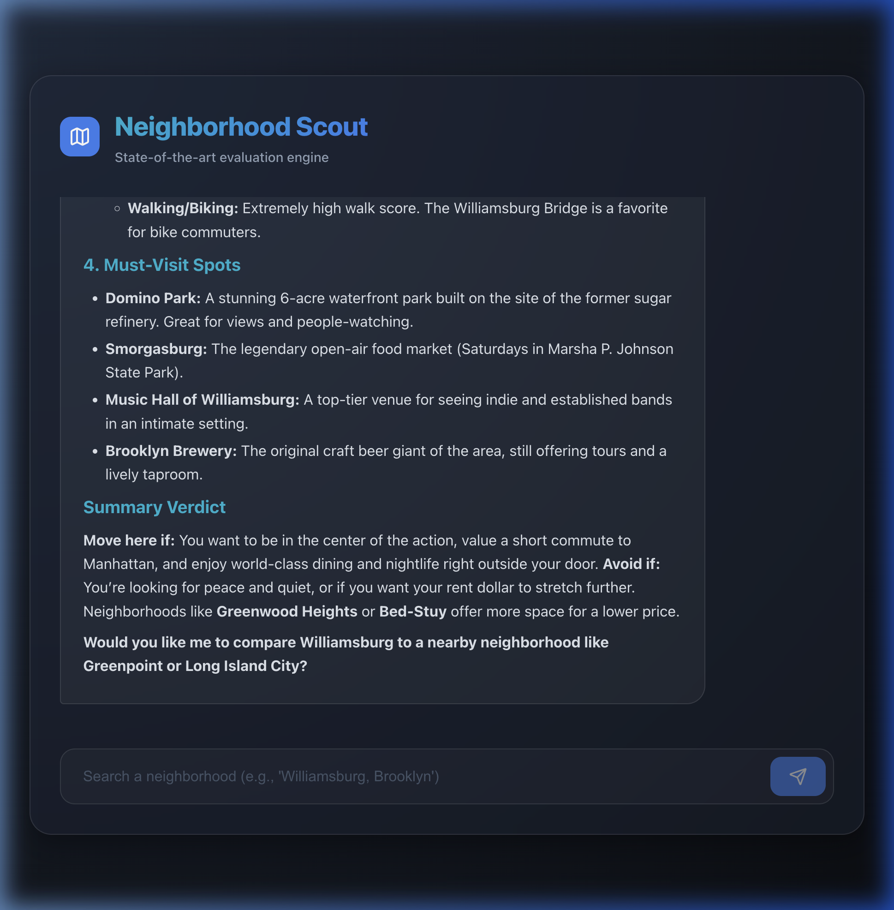

# 🏘️ Neighborhood Scout

Evaluating neighborhoods with state-of-the-art AI. Built using the **Gemini @google/genai SDK**.

Neighborhood Scout is a dual-interface agent designed to help users evaluate neighborhoods. It leverages the official **`@google/genai`** SDK to orchestrate multi-tool grounding and context circulation server-side via the **Interactions API**.

## 🚀 Features

- **Dual Interfaces**: High-speed **CLI** for terminal power users and a **Premium Web UI** with a modern dark-mode aesthetic.
- **Rendered Reports**: Web version features full **Markdown rendering** for professional and readable scouting reports.
- **Combined Tool Grounding**: Seamlessly integrates **Google Maps**, **Google Search**, and **Custom Functions**.
- **Context Circulation**: Automatic data transfer between tools (e.g., Search results flowing into budget calculations).

## 🖥️ Web Interface


## 🛠️ Getting Started

### Prerequisites
- Node.js (v18+)
- A Google AI API Key (from [Google AI Studio](https://aistudio.google.com/)).

### Installation
1.  Clone the repository and install dependencies:
    ```bash
    git clone https://github.com/ppongtong/neighborhood-scout.git
    cd neighborhood-scout
    npm install
    ```
2.  Configure your environment in a `.env` file:
    ```env
    GOOGLE_API_KEY=your-api-key-here
    ```
3.  Build the project:
    ```bash
    npm run build
    ```

### How to Run

| Interface | Command | Description |
| :--- | :--- | :--- |
| **CLI** | `npm start` | Fast, terminal-based scouting. |
| **Web** | `npm run dev:web` | Starts Backend (3001) and Frontend (5173). |

---
